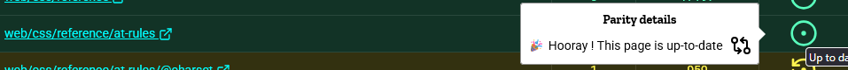
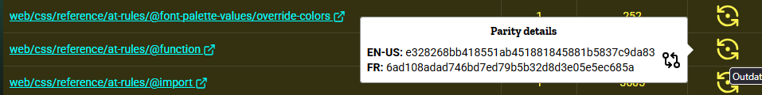
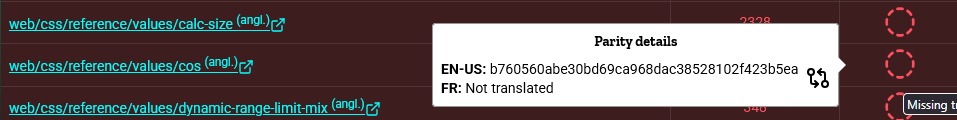

La version 2.7.0 du projet communautaire de [suivi des états de traduction des pages du MDN (angl.)](https://tristantheb.github.io/history-content/) passe en pré-version ce mercredi 22 avril 2026. Cette version apporte un changement extrêmement utile et attendu.

{/* truncate */}

:::info
Ceci est une version en cours de développement, des problèmes peuvent survenir, merci [d'ouvrir un ticket d'incident (angl.)](https://github.com/tristantheb/history-content/issues) sur [le dépôt concerné (angl.)](https://github.com/tristantheb/history-content).
:::

## Changements notables

Les changements cités ici sont temporaires et peuvent être amenés à changer d'ici la sortie officielle de la mise à jour, prévue le lundi 27 avril 2026.

### Ajouts

- Une nouvelle colonne de Parité a été ajoutée, elle permet de savoir combien d'instantanés de version (<i lang="en">commit</i>) elle a de retard par rapport à sa page parente (`en-US`).
- Une boîte d'information a été ajoutée sur l'icône de statut pour vous donner les informations sur les différences de <i lang="en">commit</i>.
  Elle se présente sous la forme [d'un conteneur ancré](https://developer.mozilla.org/docs/Web/CSS/Guides/Anchor_positioning) et vous permet, d'un simple passage de souris, de retrouver les clés de <i lang="en">commit</i> complètes.

  :::info[Note]
  Cette fonctionnalité est <i lang="en">Baseline</i> depuis janvier 2026, nous conseillons donc fortement d'utiliser [un navigateur compatible (angl.)](https://caniuse.com/css-anchor-positioning).
  :::

  Il existe plusieurs états…

  - …lorsque la page est à jour&nbsp;:
    
    

  - …lorsque la page a du retard&nbsp;:
    
    

  - …et lorsque la page n'a pas de clé communiquée à l'intérieur ou n'est pas traduite&nbsp;:
    
    

### Modifications

- L'outil a subi une forte refonte de son code et du fonctionnement de ses données. Cela avait divers objectifs et venait compléter un travail qui avait été commencé en mars 2026&nbsp;:
  - Les données sont séparées dans des fichiers CSV qui sont générés toutes les 6 heures dans un dépôt secondaire avec un format qui permet de récupérer les pages et leur administrer des informations complémentaires.
  - Récemment a été ajouté un calcul de parité pour permettre de récupérer la différence et le nombre de version de retard d'un document en même temps que les hash des fichiers. Cela a donc demandé d'apprendre à l'outil à lire deux fichiers qui sont complémentaires.
  - Il y avait un besoin de regrouper les données sous un seul et même type `PageData` plutôt que deux `EnglishData` et `TranslatedData`, de ce fait, avec le nouveau type de donnée, nous avons la possibilité de traiter une page dans sa double version&nbsp;; la version anglaise et la langue des visiteur·euse·s en un seul point.

    :::warning
    Malgré de changement, le site doit calculer un nombre (au dernier calcul) de 14364 pages fois 2 langues. Selon la configuration le tableau peut prendre 2 secondes à 30 secondes pour se générer.

    Une fois entièrement affiché, toutes les actions que vous faites avec la recherche sont instantanées.
    :::
- Les règles de typages et d'écriture ont été renforcées, une grosse partie des nouvelles fonctionnalités ont été documentées dans le code.

### Corrections

- Divers curseurs n'utilisaient pas le style de bouton cliquable, ce qui est maintenant corrigé. _Let's push the button!_
- Des imports n'annonçaient pas le fait qu'ils s'agissaient d'un _type_, c'est maintenant appliqué partout. _Un petit ménage de printemps._
- ReviewDog ne sera plus aussi agressif quand vous êtes en train de faire des préparations dans un brouillon. (Cependant LeftHook continuera à vous interdire de pousser du code qui ne respecte pas les 3 correcteurs de styles.) _Who let the dogs out? 🎵_
