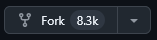
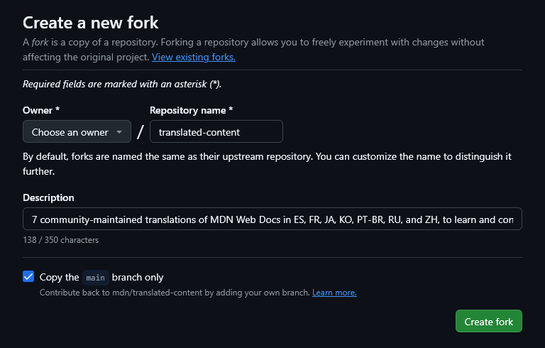
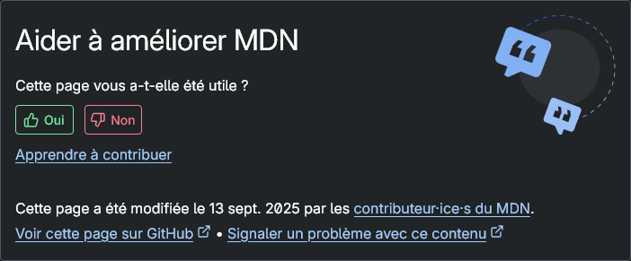
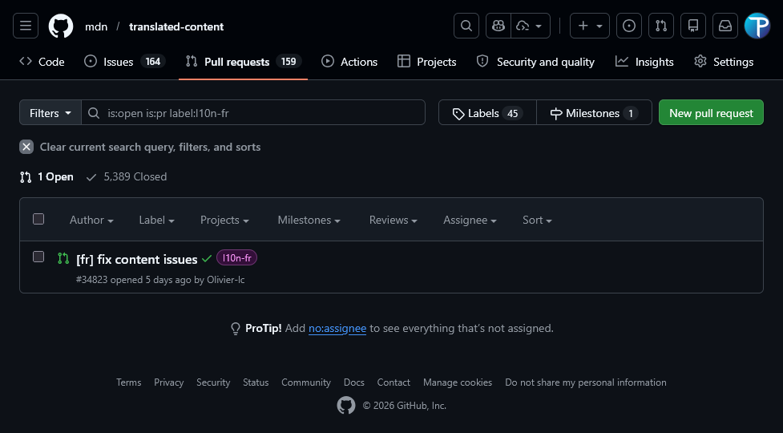

Ce guide vous présent la méthode de contribution au MDN par le biais de modification des pages Markdown en utilisant l'interfacde de Github. Les dépôts sont bigurqués pour permettre à chacun de faire des modifications sans impacter le dépôt principal avec des actions potentiellement dangereuses.

## Bifurquer le dépôt principal

import { Pencil } from 'lucide-react'

La bifurcation (<i lang="en">fork</i> en anglais) est une opération qui consiste à créer une copie profonde d'un dépôt pour apporter ses améliorations, tester dans son environnement local, développer sa fonctionnalité, avant même de proposer les modifications pour le fusionner dans le dépôt principal.

Voici les étapes à suivre pour bifurquer un dépôt, nous allons utiliser [le dépôt des traductions du MDN](https://github.com/mdn/translated-content) comme exemple :

1. Pour bifurquer le dépôt du MDN, rendez-vous sur la page de ce dernier et cliquez sur le bouton `Fork` situé en haut à droite de la page.

   

2. Une fois cliqué, vous devrez compléter un formulaire pour intégrer le dépôt dans votre compte Github comme copie, le nommer (si vous souhaitez changer son nom) et choisir si vous souhaitez copier toutes les branches ou seulement la branche principale (ce que nous recommandons).

   

3. Une fois effectué, nous pourrez naviguer dans le dépôt pour modifier la page que vous souhaitez.
   - Les pages sont rangées dans les dossiers `files/fr/`, ce qui rend les différentes catégories très strcuturées et facile à naviguer.

     ```plain title="Structure du dépôt"
     📂 files
     │  …
     ├─ 📂 fr
     │  ├─ 📁 games
     │  ├─ 📁 glossary
     │  ├─ 📁 learn_web_development
     │  ├─ 📁 mdn
     │  ├─ 📁 mozilla
     │  ├─ 📁 web
     │  └─ 📁 webassembly
     └─ …
     ```

   - Les pages sont rangées de la même manière que le chemin qui est écrit à l'intérieur du fichier. Par exemple si vous cherchez l'attribut universel HTML `title` :

     ```markdown title="Structure vers « files/fr/web/html/reference/global_attributes/title/index.md »" {6-7}
     📂 files/fr
     └─ 📁 web
        └─ 📁 html
           └─ 📁 reference
              └─ 📁 global_attributes
                 └─ 📁 title
                    └─ 📄 index.md <- Ceci est le fichier qui décrit `title`
     ```

   - Pour retrouver rapidement la page, vous pouvez aller sur elle directement la page avec **« Voir cette page sur Github »** et ouvrir sa version Github en bas de page. Attention, vous serez redirigé sur le dépôt principal, il faudra changer le début du lien par le lien de votre dépôt bifurqué.

     

Félicitation, vous avez maintenant une copie du dépôt d'origine.

## Proposer des modifications

1. Une fois que vous êtes dans la page de votre dépôt bifurqué, vous pouvez cliquez sur le petit crayon (&nbsp;<Pencil size={16} />&nbsp;) pour éditer la page.
2. Modifiez le contenu que vous souaitez changer puis, une fois que vous avez terminé, cliquez sur le bouton `Propose changes` pour proposer vos modifications. Un formulaire s'affiche pour vous demander le titre de votre instantané de modification. Nous recommendons d'utiliser les titres standardisés comme `chore(fr): description courte` pour des modifications de la documentation ou `fix(fr): description courte` lorsque vous corrigez des erreurs.
   Nommer de cette manière respecte les [conventions de nommages des instantanés de modification <sup>(angl.)</sup>](https://www.conventionalcommits.org/en/v1.0.0/#specification).

   Une fois la description courte écrite, vous devez choisir de « Créer une nouvelle branche » et la nommer. Si vous souhaitez vous retrouver entre vos branche, pensez à leur donner un nom facile à comprendre.

   :::warning
   Vous ne devez jamais modifier le contenu de la branche `main`, c'est pourquoi lorsque vous enregistre la modification, vous créez une nouvelle branche. Comme ça vous bifurquez la branche principale vers une version modifiée qui n'impacte pas la branche principale. Cela vous permet de garder la branche `main` à jour et l'actualiser à chaque fois que vous voulez mettre à jour votre dépôt bifurqué ou faire une nouvelle modification.
   :::

3. Une fois tout complété, vous pouvez retourner sur [le dépôt principal](https://github.com/mdn/translated-content) pour créer une requête de tirage (<i lang="en">pull request</i> en anglais) afin d'intégrer vos modifications dans le MDN. Si vous le faites directement après avoir enregistré la modification, un bandeau jaune s'affiche pour ouvrir directement la requête. Sinon, vous pouvez cliquer sur l'onglet `Pull requests` du dépôt principal et cliquer sur le bouton `New pull request` pour créer une nouvelle requête de tirage.

   

   :::info
   Il est important de bien compléter la description qui vous sera générée pour que l'équipe de relecture puisse comprendre les motivations derrière votre proposition.
   :::

Une fois cela effectué, vous pouvez continuer d'utiliser votre dépôt bifurqué pour modifier d'autres pages. Partez toujours de la branche principale (`main`) pour créer les branches de vos modifications.

Il ne vous reste plus qu'à attendre d'un membre de l'équipe de relecture vienne examiner votre requête, la corriger et la valider. Dans le cas où des erreurs seraient à corriger, vous aurez une liste des modifications nécessaires, à appliquer.

## Résumé

Nous avons vu dans ce guide comment mettre en place son dépôt biffurqué et comment contribuer en effectuant des modifications sur les pages depuis Github. A partir d'ici, vous pouvez faire des petites modifications pour mettre à jour ou corriger les pages du MDN. Pour effectuer des opérations plus complexes, nous vous invitons à lire le guide suivant qui vous apprendra à créer des pages, ajouter des images et utiliser un environnement local.
