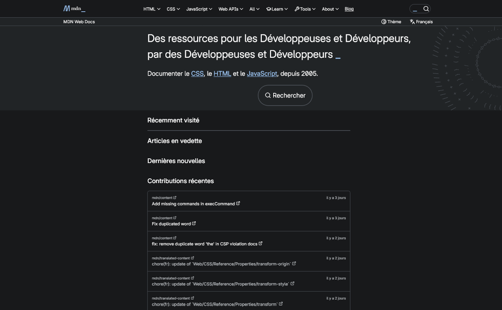
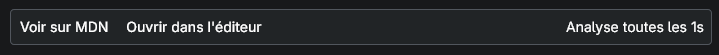

Pour pouvoir contribuer au MDN pleinement, en utilisant un environnement de développement local adapté à votre besoin, nous allons vous présenter les différents éléménts et étapes nécessaires pour préparer votre future contribution.

## Prérequis, avant de commencer

Pour pouvoir mettre en place un environnement de travail qui vous permettra de contribuer, vous devez répondre à certains critères techniques.

| Technologie                                                       | Difficulté |
| ----------------------------------------------------------------- | ---------- |
| Un éditeur ([Visual Studio Code](https://code.visualstudio.com/)) | Facile     |
| [Git](https://git-scm.com/)                                       | Moyenne    |
| [Node.js](https://nodejs.org/) `24.x` et npm `11.9`               | Moyenne    |

Installer un éditeur ou utiliser votre éditeur favori pour préparer votre environnement de travail. Nous avons mis VSCode puisque nous proposons également un plugin dédié aux macros et leur syntaxe.

## Cloner les dépôts qui vont permettre de travailler localement

Le MDN utilise un outil nommé **Fred** (pour **Fr**ont-**E**n**d**) qui permet de rendre les pages au format du MDN comme si vous utilisiez le site directement. Cependant, l'outil ne fonctionne pas seul, il a besoin que nous y connections les dépôts contenant les pages _anglaises_ et _traduites_.

Pour ce faire, créer un dossier sur votre ordinateur qui vous servira de point de travail pour copier les dépôts.

Pour que cela fonctionne, nous aurons besoin que le dossier de travail contienne les dépôts de la manière suivante :

```plain
📂 <votre-dossier>
├─ content
├─ fred
└─ translated-content
```

Pour arriver à ça, nous allons commencer par cloner les 3 dépôts.

### Cloner le dépôt de travail `mdn/fred`

Le dépôt contenant le serveur local sera la première étape pour paramétrer ses variables d'environnement et installer les dépendances nécessaires à son bon fonctionnement.

Ouvrez un terminal de commande dans votre dossier de travail pour exécuter les commandes suivantes :

```bash title="BASH"
git clone https://github.com/mdn/fred.git fred
```

Une fois le dossier créé et complété par le clone, ouvrez-le dans votre éditeur pour créer un fichier `.env` qui définira les variables d'environnement nécessaires pour avoir les outils nécessaires.

Voici le contenu du fichier à ajouter :

```yaml title=".env" showLineNumbers
# https://github.com/mdn/content
CONTENT_ROOT=../content/files
# https://github.com/mdn/translated-content
CONTENT_TRANSLATED_ROOT=../translated-content/files

RUMBA_URL="https://developer.allizom.org"
CF_URL="https://developer.allizom.org"
RARI_URL="http://localhost:8083"

FRED_WRITER_MODE=true

# legacy react-specific environment variables
REACT_APP_KUMA_HOST="localhost:3000"
REACT_APP_FXA_SIGNIN_URL="/users/fxa/login/authenticate/"
REACT_APP_FXA_SETTINGS_URL="https://accounts.stage.mozaws.net/settings/"
REACT_APP_PLACEMENT_ENABLED="true"
```

Une fois le fichier créé et enregistré, vous pouvez installer les dépendances du projet pour préparer son futur démarrage.

```bash title="BASH"
npm i
```

Nous reviendrons dans ce dossier plus tard. Vous pouvez quitter ce dossier sur votre éditeur, l'éditeur va maintenant uniquement utiliser le dépôt de travail que vous souhaitez utiliser.

### Cloner les dépôts de langue

Maintenant que le dossier de Fred est prêt, depuis votre dossier de travail, vous allez devoir cloner les dépôts suivants :

```bash title="BASH"
git clone https://github.com/mdn/content.git content
git clone https://github.com/mdn/translated-content.git translated-content
```

Chaque commande va prendre un moment pour cloner les dépôts.

Lorsque c'est fait, vous pouvez ouvrir le dossier des traductions `translated-content` dans votre éditeur.

Depuis le terminal de votre éditeur, vous allez pouvoir exécuter la commande suivante :

```bash title="BASH"
cd ../fred && npm run start
```

Ce sera la commande que vous utiliserez à chaque fois pour lancer Fred et ouvrir le serveur local, tout en étant dans le dossier de traduction.

Ce que fait cette commannde :

- `cd` signifie « change directory » (changer de dossier), elle vous permet de remonter de 1 niveau avec  `..` et aller dans le dossier `fred` depuis le dossier parent de `translated-content` et `fred`. C'est pour cela que les 3 dossiers sont voisins dans le même dossier de travail.
- `npm run start` est la commande qui lance le serveur local de Fred. C'est la commande commune à de nombreux projets utilisant un environnement JavaScript ou TypeScript pour lancer un serveur local.

Une fois effectué, un serveur local sera ouvert à l'adresse [`http://localhost:3000`](http://localhost:3000/fr/)
Vous pouvez donc commencer à naviguer entre les pages des diverses langues à partir de l'accueil, cet accueil ressemble à ceci :



À la différence de Yari, le serveur local ne permet pas de voir les différentes erreurs de liens, macros, pages directement dans son interface, ces erreurs sont affichées dans la console directement.
Les pages sont actualisées toutes les secondes, elles ne se rechargent cependant que lorsque vous enregistrez une modification sur la page que vous regardez.

Depuis la page, vous avez plusieurs outils qui sont proposés en haut :



- Voir sur le MDN
  - Cela vous retournera la page dans la langue choisie sur le MDN.
- Ouvrir dans l'éditeur
  - Cela nécessite d'ajouter une option dans les variables d'environnement de Fred, une fois activée, l'option ouvre la page dans votre éditeur sélectionné.

    ```yaml title=".env" showLineNumbers
    EDITOR=code # pour Visual Studio Code
    ```

Félicitation, vous avez terminé de mettre en place votre environnement de travail, vous êtes prêt·e à contribuer au MDN en commençant à modifier les pages que vous souhaitez.

## Résumé

Nous avons mis en place l'environnement local pour ouvrir le serveur local Fred et afficher les pages des dépôts de contenu. Nous pouvons maintenant aborder les différentes façons de contribuer au MDN grâce à un environnement dédié.
