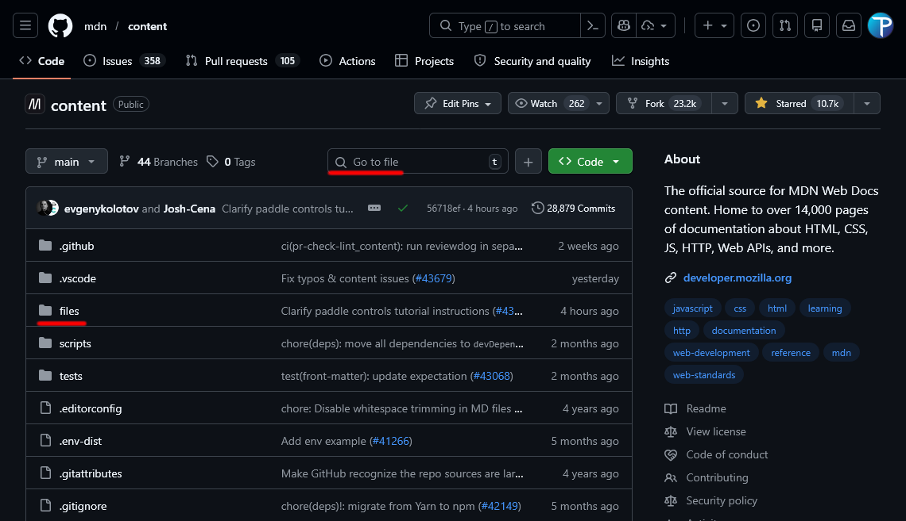
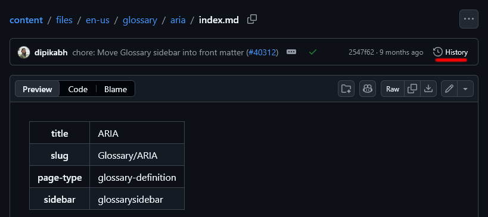
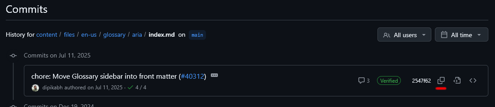

Le Markdown prend en charge les métadonnées comme le ferait une page HTML, dans un encadré nommé « <i lang="en">Front Matter</i> » qui peut se traduire par **Page de garde**. Ces métadonnées sont rangées en haut de la page Markdown, dans un format nommé YAML (équivalent à du JSON avec une syntaxe simplifiée).

## Le balisage des métadonnées

import { Copy } from 'lucide-react'

Pour que les métadonnées soient lues et interprétées par le moteur de rendu [Rari <sup>(angl.)</sup>](https://github.com/mdn/rari) (qui s'occupe de transformer le Markdown en HTML), elles doivent être encadrées en haut du document, dès la première ligne, par trois tirets `---` comme si vous ouvriez un bloc de code en Markdown. Le bloc doit être refermé de la même manière.

Ecrire les délimiteurs donnera ceci :

```markdown title="index.md" {1-2} showLineNumbers
---
---

Contenu de votre page
```

Pour que cela fonctionne, il faut impérativement éviter d'écrire autre chose autour des tirets, comme des espaces. L'ouverture doit se trouver à la première ligne du document, aucune ligne vide ne doit se trouver avant, aucun paragraphe ne doit se trouver avant.

Une fois que le bloc est ouvert, il est possible d'y écrire les données avant de le refermer. Nous allons voir quelles sont les clés qui sont autorisées.

### Clés et valeurs

Les données qui sont utilisées dans la partie traduite de la documentation sont :

- `title`
  - Représente le titre de la page, en texte long. Si le titre contient le caractère deux-points (`:`), il faut entourer le titre de guillemets (`"`). (Cette ligne est à traduire en français quand vous la récupérez du contenu anglais.)

- `short_title`
  - Représente le titre court de la page, il est affiché dans le fil d'Ariane et dans les barres de navigation latérales en remplacement du titre long. (Cette ligne est à traduire en français quand vous la récupérez du contenu anglais.)

- `slug`
  - Représente le chemin d'accès à la page, à partir de la racine `/files/fr/`. Les pages ne comportent donc que la suite du chemin selon les noms des dossiers.

    Par exemple, pour la page d'un élément HTML comme `<section>`, le chemin sera `Web/HTML/Reference/Elements/section`.

- `original_slug`
  - Cette valeur est créée par le robot des synchronisations des pages. Cela se produit quand une page change de chemin, par exemple lorsqu'un dossier change de nom ou de place. La valeur de `slug` utilisant l'ancien chemin est remplacée par le nouveau, et l'ancien chemin est enregistré dans `original_slug`.

    Cette valeur n'a pas d'utilité en dehors du processus de synchronisation. Nous supprimons systématiquement cette clé et sa valeur.

- `l10n.sourceCommit`
  - Afin de suivre l'évolution des pages par rapport à leur source, nous enregistrons le code de 40 caractères qui identifie l'instantané de la page source. Cette valeur est récupérable sur la page Github anglaise dans son historique de modifications.

    :::tip
    Vous pouvez utiliser le plugin [MDN Macro Syntax <sup>(angl.)</sup>](https://marketplace.visualstudio.com/items?itemName=tristantheb.mdn-macros-syntax) sur VSCode pour profiter de la proposition automatique de la valeur `sourceCommit` à jour.
    :::

    :::warning
    Cette clé ne s'écrit pas comme nous le présentons ici, regardez [l'exemple de page de garde](#exemple-de-page-de-garde) que nous présentons après.
    :::

### Exemple de page de garde

Mettons en pratique ce que nous avons appris avec un exemple d'une page de garde provenant du MDN.

```markdown title="index.md" {2-5} showLineNumbers
---
title: "<section> : l'élément de section générique"
slug: Web/HTML/Reference/Elements/section
l10n:
  sourceCommit: 0754cd805a8e010d2e3a2a065f634a3bcf358252
---

Contenu de la page
```

Comme vous pouvez le remarquer, les données sont écrites sous une forme `clé: valeur` et ne sont séparées que par des retours à la ligne. Lorsqu'une clé contient une autre clé, on ajoute une indentation pour ajouter un niveau hiérarchique à la clé enfant.

C'est pourquoi nous n'écrivons pas :

```yaml showLineNumbers=4
# bad-example
l10n.sourceCommit: 0754cd805a8e010d2e3a2a065f634a3bcf358252
```

mais plutôt :

```yaml showLineNumbers=4
# good-example-start
l10n:
  sourceCommit: 0754cd805a8e010d2e3a2a065f634a3bcf358252
# good-example-end
```

Notez comment la clé `sourceCommit` est indentée par rapport à sa clé parente. Il faut respecter l'espacement de `2` qui est nécessaire pour que le YAML considère que la clé est un enfant de `l10n`.

### Trouver le SHA sur Github

Il existe plusieurs méthodes pour trouver la chaîne de caractères de 40 caractères hexadécimaux, ces méthodes passent par différents outils. Pour ce faire, nous allons, dans l'ordres, vous expliquer comment trouver le SHA sur GitHub, avec les commandes Git et avec le plugin [MDN Macro Syntax <sup>(angl.)</sup>](https://marketplace.visualstudio.com/items?itemName=tristantheb.mdn-macros-syntax) pour VSCode.

#### Sur Github

Pour récupérer la clé SHA sur Github, il vous faut vous rendre sur le fichier source que vous pouvez accéder par le biais [du dépôt anglais <sup>(angl.)</sup>](https://github.com/mdn/content) de la documentation. Pour cela, vous devrez retrouver le fichier par le biais de son chemin à partie de `files/en-us/` ou par la recherche.



Une fois que vous avez localisé et ouvert le fichier `index.md` de la page anglaise correspondante, à la page que vous éditez, vous devez cliquer sur le bouton « History » situé à droite du dernier changement effectué sur le fichier.



Une liste de changements s'affiche et vous permet de copier le code SHA d'un simple bouton de deux carrés d'un dans l'autre (&nbsp;<Copy size={16} />&nbsp;)



Lorsque vous avez cliqué sur le bouton, le code SHA complet est copié dans votre presse-papier, vous pouvez alors l'appliquer dans la page de garde du fichier que vous éditez.

#### Avec les commandes Git

:::info
Il est nécessaire d'avoir copié le dépôt anglais comme nous l'expliquons sur le [Guide pour mettre en place son environnement](/docs/contribuer/mettre-en-place-un-environnement-de-developpement-local) sur votre machine pour effectuer cette méthode.
:::

Ouvrez votre terminal et placez-vous dans le dossier du dépôt anglais, puis utilisez la commande suivante pour trouver le code SHA de la page source :

```bash title="BASH"
git log -n 1 --pretty=format:%H -- path/to/file/index.md
```

:::note
Remplacez `path/to/file/index.md` par le chemin d'accès à la page source à partir de `files/en-us/`.
:::

Copiez le code SHA qui s'affiche dans votre terminal et appliquez-le dans la page de garde du fichier que vous éditez.

#### Le plugin VSCode

Le plugin [MDN Macro Syntax <sup>(angl.)</sup>](https://marketplace.visualstudio.com/items?itemName=tristantheb.mdn-macros-syntax) pour VSCode vous permet de profiter d'une proposition automatique de la valeur `sourceCommit` à jour, lorsque vous écrivez la page de garde de votre fichier Markdown.

Lorsque vous vous trouvez dans le fichier édité, il vous sera proposé d'ajouter ou de mettre à jour la valeur `sourceCommit` dès que le fichier le nécessitera.

## La différence avec les pages anglaises

Les données présentes dans les pages anglaises sont différentes, car elles servent à définir tous les éléments qui seront affichés dans la page comme les barres latérales, les icônes d'état de la fonctionnalité, les liens vers les spécifications, les liens vers les ressources de compatibilité, définitions CSS, etc.

Nous ne gardons aucune de ces données, car seule la page parente a besoin de les administrer, ce que nous utilisons permet de surcharger les données anglaises pour afficher une traduction à la place.

## Résumé

Nous savons maintenant écrire les métadonnées d'une page et savons ce qu'il est possible d'y écrire. Maintenant, nous allons regarder plus en détail comment fonctionnent certains éléments du MDN.
