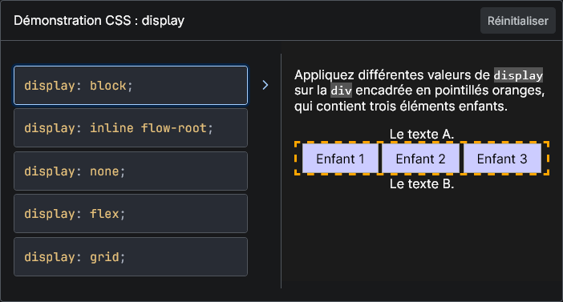
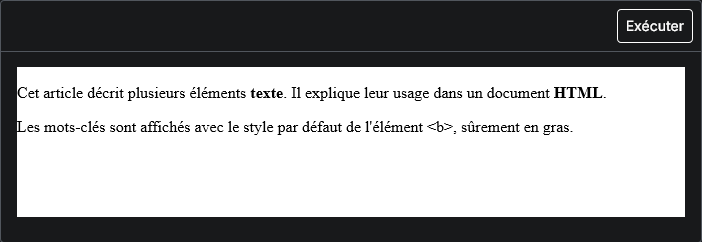

Pour permettre aux lecteur·ice·s d'expérimenter ce que la documentation présente, nous créons des exemples qui sont rendus interactifs grâce aux macros, mais surtout aux blocs de codes.

## Concepts et utilisation

De manière générale, nous créons [des blocs de code](/docs/guides/les-blocs-de-codes) pour présenter le fonctionnement de ce que la page présente, mais du code n'est pas forcément facile à comprendre pour tout le monde. De ce fait, pour permettre aux personnes qui ont une compréhension visuelle, de comprendre ce que nous avons expliqué, nous créons des exemples avec un résultat intéractif ou visuel.

Il existe deux types d'exemples en direct :

- Les exemples interactifs qui proposent des choix ou résultats dans un cadre dédié, masquant le code.
- Les exemples interactifs qui utilisent des blocs de code dans une section d'exemple titrée.

### Les exemples interactifs

Ces exemples utilisent une macro spéciale qui est située au-dessus des blocs de codes qui lui seront donnés grâce aux mots clés dédiés.

La macro utilisée est nommée `InteractiveExample`, nous la voyons plus en détails dans [nos explications sur les macros](/docs/guides/les-macros-et-leur-fonctionnement).

#### Exemple

Pour mieux comprendre ce que fait ce bloc interactif, nous allons vous présenter la manière de l'écrire.

##### Markdown

Nous commençons par appeler la macro `{{InteractiveExample}}` et on lui attribue un titre qui sera affiché dans le bloc rendu. On ajoute juste après cette macro, [les divers blocs de code](/docs/guides/les-blocs-de-codes) qui seront interprétés selon la clé qui leur est donnée :

- `interactive-example-choice` : Le bloc de code sera affiché comme un choix cliquable.
- `interactive-example` : Le bloc de code sera interprété comme le code à transformer dans le rendu.

````markdown
  {{InteractiveExample("Démonstration CSS&nbsp;: display")}}

  ```css interactive-example-choice
  display: block;
  ```

  ```css interactive-example-choice
  display: inline flow-root;
  ```

  ```css interactive-example-choice
  display: none;
  ```

  ```css interactive-example-choice
  display: flex;
  ```

  ```css interactive-example-choice
  display: grid;
  ```

  ```html interactive-example
  <p>
    Appliquez différentes valeurs de <code>display</code> sur la
    <code>div</code> encadrée en pointillés oranges, qui contient trois éléments
    enfants.
  </p>
  <section class="default-example" id="default-example">
    <div class="example-container">
      Le texte A.
      <div id="example-element">
        <div class="child">Enfant 1</div>
        <div class="child">Enfant 2</div>
        <div class="child">Enfant 3</div>
      </div>
      Le texte B.
    </div>
  </section>
  ```

  ```css interactive-example
  .example-container {
    width: 100%;
    height: 100%;
  }

  code {
    background: #88888888;
  }

  #example-element {
    border: 3px dashed orange;
  }

  .child {
    display: inline-block;
    padding: 0.5em 1em;
    background-color: #ccccff;
    border: 1px solid #ababab;
    color: black;
  }
  ```
````

Voir [les autres options de `InteractiveExample`](/docs/guides/les-blocs-de-codes#le-bloc-de-code-intégré-dans-un-exemple-interactif) pour connaître les différents blocs qui existent.

##### Résultat

La macro sera rendue de la façon suivante :



### Les blocs de résultat d'exemple

Pour permettre de rendre des exemples plus visuels, nous transformons des blocs de code en résultat rendu pour permettre de comprendre ce que fait la fonctionnalité présentée, et même de fournir de l'interactivité dans certains cas.

#### Exemple

L'exemple suivant provient de [l'exemple de l'élément HTML `<b>`](https://developer.mozilla.org/fr/docs/Web/HTML/Reference/Elements/b#exemples).

##### Markdown

````markdown
  ## Exemples

  ```html
  <p>
    Cet article décrit plusieurs éléments <b class="keyword">texte</b>. Il
    explique leur usage dans un document <b class="keyword">HTML</b>.
  </p>
  Les mots-clés sont affichés avec le style par défaut de l'élément &lt;b&gt;,
  sûrement en gras.
  ```

  ### Résultat

  {{EmbedLiveSample("Exemple")}}
````

##### Résultat



Il existe des particularités pour les blocs de code que nous présentons dans le prochain article.

## Traduire le code des exemples

Le fait que nous utilisons des éléments disponibles dans la page et donc des blocs de codes accessibles dans la page, lors de la traduction, cela nous permet de traduire complètement les exemples.

De ce fait, nous traduisons tous les textes présents dans les blocs de code, les commentaires et également le code lui-même.

Cela permet entre autres aux apprennant·e·s de comprendre d'avantage ce que sont les éléments présentés dans le code.

Par exemple, parler de `popover` n'est pas forcément compréhensible pour une classe CSS, alors que `fenetre-contextuelle` est plus parlant.

Il faut, cependant, faire attention à respecter les règles d'écritures standards du code : pas d'accents, pas de caractères spéciaux, pas d'unicode. Il faut que le code rendu, soit fonctionnel.

### Exemples

Rendre un fond rouge d'un carré en CSS sera mauvaise de cette manière :

```html
<!-- bad-example -->
<div class="carré"></div>
```

```css
/* bad-example */
.carré {
  background-color: red;
  height: 100px;
  width: 100px;
}
```

Alors que cela sera fonctionnel et compréhensible de cette manière :

```html
<!-- good-example -->
<div class="carre"></div>
```

```css
/* good-example */
.carre {
  background-color: red;
  height: 100px;
  width: 100px;
}
```

## Résumé

Nous avons vu les différents types d'exemples interactifs que nous utilisons pour expliquer des fonctionnalités du web. Ces éléments sont présents en grande quantité dans la documentation et nécessitent une attention particulière pour que ces derniers continuent de fonctionner lors de leur traduction.
